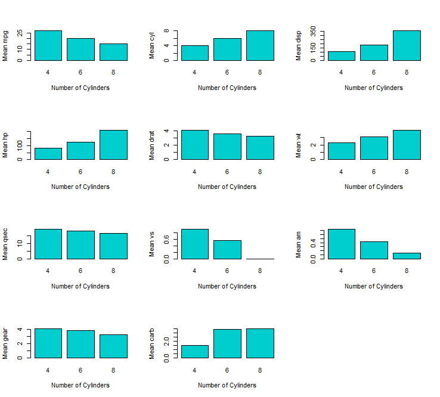

**Title:** "chain"  
**Author:** "Robert Schnitman"  
**Date:** "October 13, 2018"  

## 1. About

The function `chain()`, created under `telecast.r`, is a simplification
of `telecast()`: the output will be a matrix via `sapply()`.

    chain <- function(f, l) {
      
      # 1. Type-check inputs.
      f <- match.fun(f)
      
      # 2. Compute nestesd sapply().
      s <- sapply(l, function(z) sapply(z, f))
      
      # 3. Output should be a 2D object.
      output <- t(s)
      
      output
      
    }

## 2. Example

    l <- split(mtcars, mtcars$cyl) 
    output <- chain(mean, l)
	output
	
	##        mpg cyl     disp        hp     drat       wt     qsec        vs
	## 4 26.66364   4 105.1364  82.63636 4.070909 2.285727 19.13727 0.9090909
	## 6 19.74286   6 183.3143 122.28571 3.585714 3.117143 17.97714 0.5714286
	## 8 15.10000   8 353.1000 209.21429 3.229286 3.999214 16.77214 0.0000000
	##          am     gear     carb
	## 4 0.7272727 4.090909 1.545455
	## 6 0.4285714 3.857143 3.428571
	## 8 0.1428571 3.285714 3.500000

    all(chain(mean, l) == t(sapply(l, function(z) sapply(z, mean))))

    ## [1] TRUE

    barplot(output[, 'mpg'], col = 'cyan3', ylab = 'Mean MPG', xlab = 'Number of Cylinders')

*End of Document*
